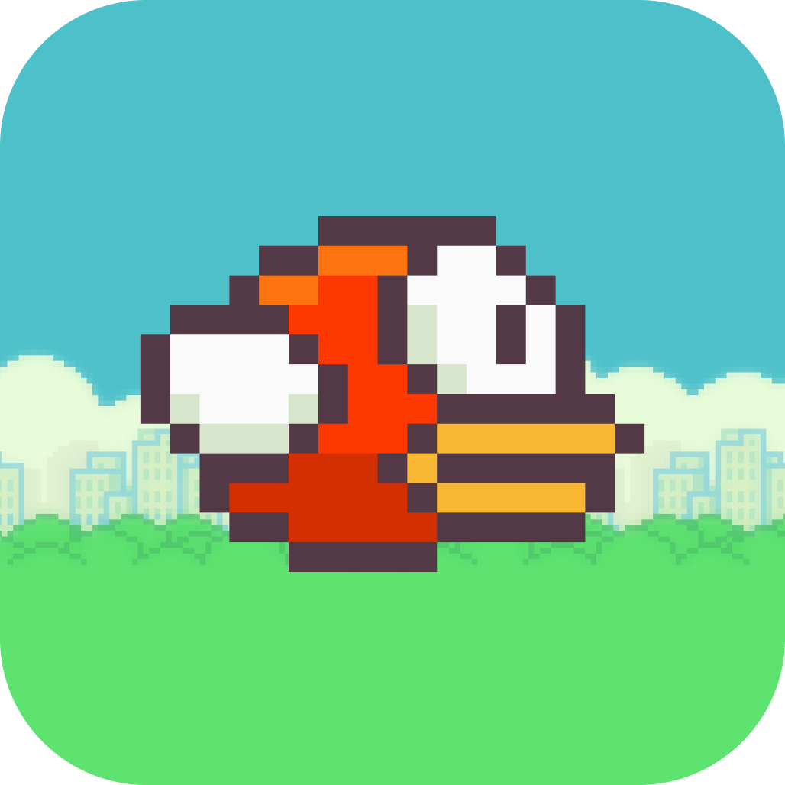
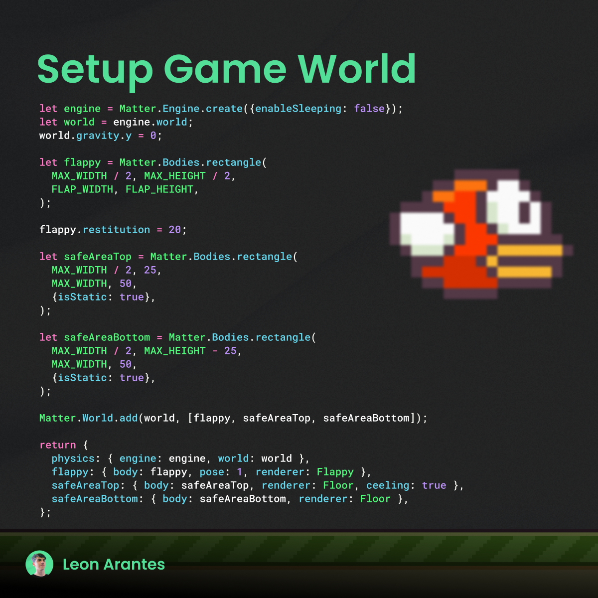
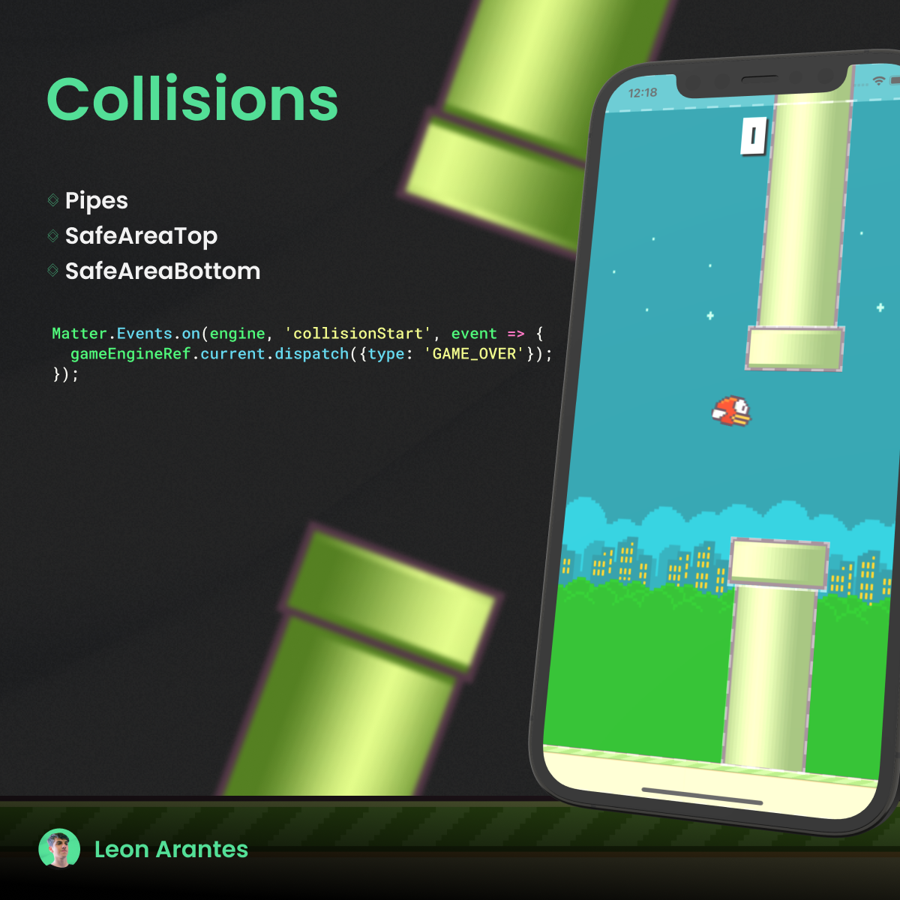
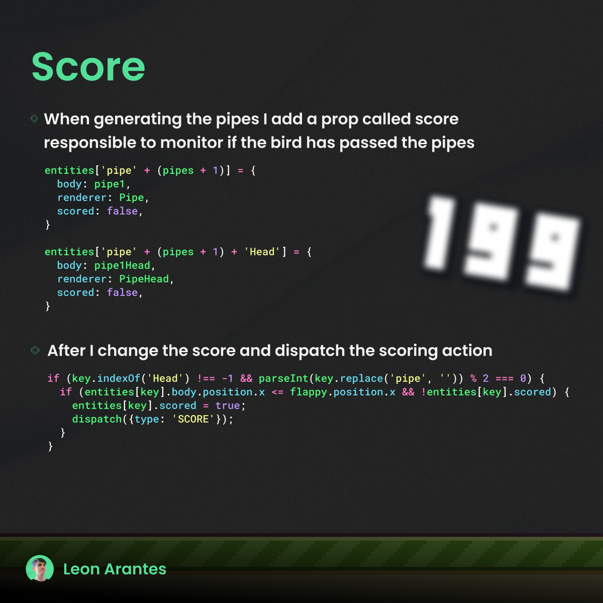

<h1 align="center"><strong>Flappy Bird React Native</strong></h1>
<h1 align="center">
    
</h1>
<h1>

 
    
    
    
    
</h1>

<h1  align="center">

</h1>
  
  
# 🔧 TECS

- React Native
- Styled Components
- Matter.js
- React Native Engine
- Async Storage
- React Native Animatable
- React Native Sound Player
